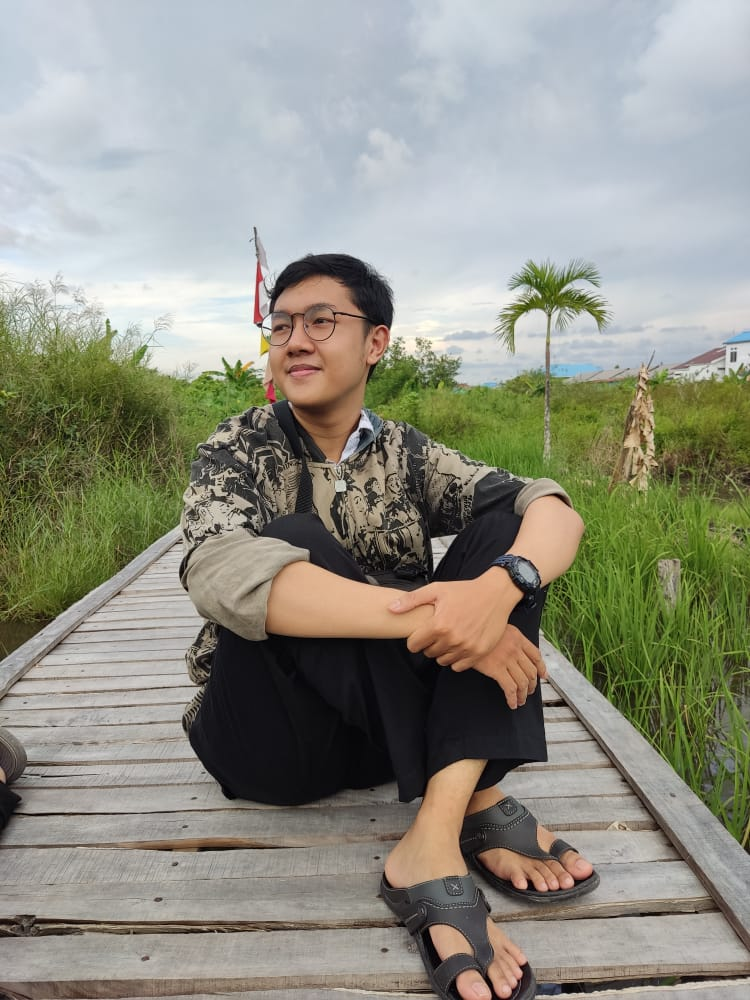


<figure style="display: block;
  margin-left: auto;
  margin-right: auto;">

  <figcaption style="text-align: center;"><b style="font-family: 'et-book-roman-old-style-figures', serif;">Anugerah</b><figcaption>
  <figcaption style="text-align: center;"><i style="font-family: 'et-book-roman-old-style-figures', serif;">Graphic Designer & Video Editor</i><figcaption>
  </figure>


**Hello there!** How are you doing? 

My name is **Anugerah** and I am a college student from The *Lambung Mangkurat University*, **Banjarmasin**, studying in the *English Language Education Study Program*. Before going into the university studying **English Language**, I was in vocational high school studying **Software Engineering**, that explained a lot about how I'm used to *coding* or *programming*. 

I do **Graphic Design** and **Video Editing**.

**NICE TO MEET YOU!**

---
## [Portfolio](/work) 🎨
---

## Education 🎓
+ **Vocational High School 4** *2018 - 2020*
+ **Lambung Mangkurat University** *2021 - current*

---
## Experiences 💼
+ **Lambung Mangkurat Debate Society**
  + *Member of Media and Design Division*
+ **Kalimantan Open Debate 2022 Event**
  + *Coordinator of Publication and Documentation Division*

---
## Experties 💡
- **Advance English Language Proficiency**
  - *Writing*
  - *Speaking*
- **Graphic Design**
  - *Social Media Post*
  - *Poster*
  - *Logo*
- **Video Editing**
  - *Infographic*
  - *Music Video*
  - *Promotion*

---
### Technical Experties ⚙️
- **Adobe Photoshop**
- **LaTex**
- **HTML**
- **CSS**
- **Markdown**
- **Vegas Pro** 
- **Adobe Premiere**
- **Adobe After Effect**
- **Office**
- **LibreOffice**

---
> # Thanks Y'all!